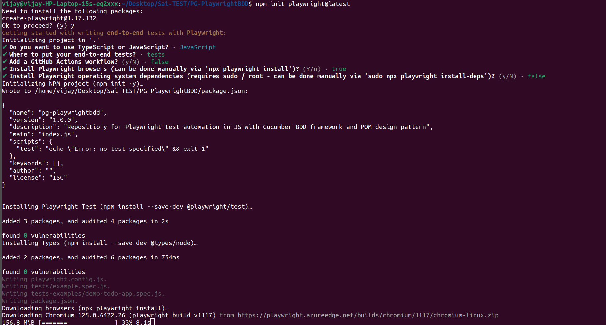

# PG-PlaywrightBDD

Repositiory for Playwright test automation in JS with Cucumber BDD framework and POM design pattern

## Playwright Setup

Playwright initialization can be done by executing -

```
npm init playwright@latest
```



## Cucumber Setup

Cucumber BDD framework plugin can be installed by executing the following -

```
npm i @cucumber/cucumber -D
npm install @cucumber/pretty-formatter -D
```

With the successful installation, we can find entry in package.json file inside the project root directory

## Execution
1. Create cucumber.config.js file in the project root directory
2. Add the below step inside the package.json file
```
  "scripts": {
    "test": "cucumber-js --require cucumber.config.js --require step-definitions/*.js  --format @cucumber/pretty-formatter"
  },
```
3. Go to console and execute 
```
npm test
```